# Product development and approval process - 2022 revision, main process draft v1 for comment

## Principles

1. GA4GH is an open standards development organisation
    1. Work should take place in ways that are publicly accessible, inclusive of new contributors, and decision making should be transparent - see Best Practices and Code of Conduct
    2. To learn more about GA4GH's mission, please see our [website](https://www.ga4gh.org) and [2013 White Paper](https://www.ga4gh.org/document/white-paper/).
    3. For background on open standards, please see the [OpenStand principles](https://open-stand.org/about-us/principles/) and [Open Source Initiative criteria](https://opensource.org/osr/).
2. GA4GH products should be developed through **broad consultation and consensus**
3. GA4GH aims to develop a small number of products that are of broad utility
4. GA4GH works alongside other standards development organisations in a cooperative manner in whatever way best supports the application of genomics in health and the broader genomics community (including other groups developing standards)
5. Products should seek to interoperate with existing products (from GA4GH or elsewhere). Members of the Technical Alignment Subcommittee (TASC) are the custodians of technical alignment information and decision making. This information should be consulted throughout development work.
6. GA4GH should seek to reuse or adopt existing products, from outside GA4GH, where that makes sense
7. Stakeholders are expected to respect the principles set by our Code of Conduct at all times
8. Groups should follow our Best Practises (or be willing to demonstrate to Steering Committee that their alternative practices are more appropriate)
9. GA4GH policies on copyright, intellectual property (IP), and other topics must be observed and should be shared at the start of calls and when onboarding (along with our Best Practises, Code of Conduct, and all relevant documentation)
10. Documentation generated for products during product development and approval should give clarity on the points on which decision making is based. It should not be longer than is essential. Reuse, where appropriate, is encouraged.
11. New versions of existing standards can fast track documentation by using existing documentation and highlighting changes. However, they must still follow the process and principles defined in this document: consultation, clear problem definition, and stakeholder engagement. These are not optional.
12. Where decisions in the process are with Secretariat, final decision making rests jointly with GA4GH's Chief Executive Officer (CEO) and Chief Standards Officer (CSO), with decision making support from Secretariat as appropriate. In the event that the CEO and CSO disagree, the decision is passed to GA4GH's Executive Committee.
13. In the event of dispute or uncertainty in this process (caused by lack of clarity in this document or for any other reason), the primary responsibility to resolve the situation rests jointly with GA4GH's CEO and CSO. They should attempt to identify a way forward, which should then be put to the Executive Committee for approval. Anyone wishing to initiate this process should contact the CEO and CSO by email. If Executive Committee choose to, they can consult the full Steering Committee.
14. Secretariat are available to provide support and assistance at all stages of the process.

```mermaid
flowchart LR;

%% colours used for the different classes in the diagram
classDef outsideOriginClass fill:#52b5bc;
classDef ideaClass fill:#88ddb3;
classDef issueClass fill:#c388dd;
classDef updateClass fill:#de4a96;
classDef decisionClass fill:#efd225;
classDef detailClass fill:#ee842b;
classDef actionClass fill:#071ef2,color:#fff;
classDef stopClass fill:#e31c31;
classDef approvalClass fill:#2d9717;

%% the starting points
startOutside([Standard outside<br>of GA4GH]):::outsideOriginClass;
startIdea([I have an idea<br>for a standard]):::ideaClass;
startIssue([I have an issue where<br>a standard might help]):::issueClass;
startUpdate([I want to update an<br>existing GA4GH standard]):::updateClass;

%% consideration of issues for standards starting outside of GA4GH
startOutside-->importIssuesDecision{IP or other<br>issues?}:::decisionClass;
importIssuesDecision --- detail1((1)):::detailClass;
importIssuesDecision -->|yes| resolveImport[Work with Secretariat to see if<br>there is a solution. If not,<br>cannot proceed.]:::actionClass;

%% already an active group?
activeGroupDecision{Already an<br>active group?}:::decisionClass;
activeGroupDecision --- detail2((2)):::detailClass;
importIssuesDecision -->|no| activeGroupDecision;
startIdea --> activeGroupDecision;
startIssue --> activeGroupDecision;
startUpdate --> activeGroupDecision;

%% existing group?
engageGroup[Engage with existing<br>group]:::actionClass;
activeGroupDecision -->|yes| engageGroup;
interestDecision{Interest<br>& support?}:::decisionClass;
engageGroup --> interestDecision;
detail3((3)):::detailClass;
interestDecision --- detail3;
noInterestStop([Stop]):::stopClass;
interestDecision -->|no| noInterestStop;

%%existing group is interested
typeOfChangeDecision{Type of<br>change?}:::decisionClass;
interestDecision -->|support update| typeOfChangeDecision;
detail23((23)):::updateClass;
typeOfChangeDecision --- detail23;


%% if no group, is anyone interested?
lookForPeople[Look for people with<br>shared interests in a<br>wide variety of<br>contexts]:::actionClass;
detail4((4)):::detailClass;
activeGroupDecision -->|no| lookForPeople;
lookForPeople --- detail4;

enoughPeopleDecision{Continue?}:::decisionClass;
lookForPeople <--> enoughPeopleDecision;
detail5((5)):::detailClass;
enoughPeopleDecision --- detail5;
noPeopleStop([Stop]):::stopClass;
enoughPeopleDecision -->|no| noPeopleStop;



%%urgent fix
urgentFix[Urgent Fix<br> - PRC notified immediately<br> - Group develops a solution]:::actionClass;
typeOfChangeDecision --->|urgent fix| urgentFix;
urgentFix --- detail24((24)):::updateClass;
urgentFix --> fixAgreementDecision{Agree<br>fix?}:::decisionClass;
fixAgreementDecision -->|yes| fastTrackReview[Fast Track Review]:::actionClass;
fixAgreementDecision --- detail25((25)):::updateClass;
fastTrackReview --- detail26((26)):::updateClass;
fixAgreementDecision -->|no| resolveIssues[Resolve<br>remaining<br>issues]:::actionClass;
resolveIssues --- detail28((28)):::updateClass;
resolveIssues --> fixAgreementDecision;
fastTrackApprovalDecision{Approved?}:::decisionClass;
fastTrackApprovalDecision --- detail27((27)):::updateClass;
fastTrackApprovalDecision -->|yes| fixApproved([Approved]):::approvalClass;
fastTrackReview --> fastTrackApprovalDecision;
fastTrackApprovalDecision -->|no| resolveIssues;

%%continued development
trackApprovedDecision{Track<br>approved?}:::decisionClass;
trackApprovedDecision --- detail29((29)):::updateClass;
continuedDevelopment[Continued Development]:::actionClass;
continuedDevelopment --- detail30((30)):::updateClass;
typeOfChangeDecision ---->|continued development| trackApprovedDecision;
trackApprovedDecision -->|yes| continuedDevelopment;
trackApprovedDecision -->|no| typeOfChangeDecision;
groupAgreesConDevDecision{Group<br>agrees?}:::decisionClass;
continuedDevelopment --> groupAgreesConDevDecision;
groupAgreesConDevDecision -->|no| continuedDevelopment;
groupAgreesConDevDecision --- detail31((31)):::updateClass;
continuedReview[PRC and Public Review]:::actionClass;
groupAgreesConDevDecision -->|yes| continuedReview;
groupAgreesConDevDecision -->|stop| conStop([Stop]):::stopClass;
continuedReview --- detail32((32)):::updateClass;
conDevPRCApproval{PRC<br>approves?}:::decisionClass;
continuedReview --> conDevPRCApproval;
conDevPRCApproval --- detail33((33)):::updateClass;
conDevPRCApproval -->|yes| continuedApproved([Approved]):::approvalClass;
conDevPRCApproval -->|more comment| continuedReview;
conDevPRCApproval -->|no| continuedDevelopment;


%% establishing a study group
establishStudyGroup[Establish Study Group and set up PRC<br> - Broad outreach effort<br> - Landscape analysis<br> - Stakeholdaer engagment<br> - Use cases<br> - REWS and Security consultation<br> - Problem statement defining scope]:::actionClass;
interestDecision -->|support new standard| establishStudyGroup;
typeOfChangeDecision --->|scope or breaking| establishStudyGroup;
enoughPeopleDecision --->|yes| establishStudyGroup;
establishStudyGroup --- detail6((6)):::detailClass;
establishStudyGroup --- detail7((7)):::updateClass;
establishStudyGroup --- detail8((8)):::outsideOriginClass;


%% does the study group proceed to Steering Committee?
studyGroupDecision{Continue?}:::decisionClass;
establishStudyGroup<-->studyGroupDecision;
studyGroupDecision --- detail9((9)):::detailClass;
studyGroupNo([Stop]):::stopClass;
studyGroupDecision -->|no| studyGroupNo;
studyPrcDecision{PRC<br>supports?}:::decisionClass;
studyGroupDecision -->|yes| studyPrcDecision;
studyPrcDecision --- detail10((10)):::detailClass;
studyGroupPresentation[Study Group presents outputs to SC<br> - Evidence of outreach<br> - Landscape analysis<br> - List of those planning to adopt<br> - Use cases<br> - REWS and Security<br> - Problem statement defining scope]:::actionClass;
studyPrcDecision --->|yes| studyGroupPresentation;
studyGroupPresentation --- detail11((11)):::detailClass;
studyGroupReview[Group reviews]:::actionClass;
studyPrcDecision -->|no| studyGroupReview --> studyGroupDecision;

%% Steering Committee evaluates Study Group outputs and makes decision
scReviewsStudy[SC subset/delegates<br>review and offline<br>ballot]:::actionClass;
studyGroupPresentation --> scReviewsStudy;
scReviewsStudy --- detail12((12)):::detailClass;
scReviewsStudy --> scStudyDecision{SC<br>approves?}:::decisionClass;
scStudyDecision --- detail13((13)):::detailClass;
scStudyDecision -->|no| scStudyNo([Stop]):::stopClass;

%% moving to product development
productDev[Product development process<br> - Broad communication of new group<br> - Engage stakeholders/adopters<br> - Development in line with GA4GH Best Practices and Code of Conduct<br> - SC delegates and others who have registered interest are kept informed]:::actionClass;
scStudyDecision -->|yes| productDev;
productDev --- detail14((14)):::detailClass;
productDev <--> continueFromDev{Continue?}:::decisionClass;
continueFromDev --- detail15((15)):::detailClass;
continueFromDev -->|no| stopDev([Stop]):::stopClass;

%% comment, review and revisions
openComment[Open for comment<br> - Publc and Steering<br>Committee comment period]:::actionClass;
continueFromDev -->|yes| openComment;
openComment --- detail16((16)):::detailClass;
openComment --> commentRevisions[Group reviews and<br>revises]:::actionClass;
commentRevisions --> fullReview[PRC, REWS and<br>Security review]:::actionClass;
fullReview --- detail17((17)):::detailClass;
fullReview --> fullReviewRevisions[Group reviews and<br>revises]:::actionClass;
fullReviewRevisions --> reviewDecision{PRC, REWS<br>and Security<br>approve?<br>Further<br>comment?}:::decisionClass;
reviewDecision --- detail18((18)):::detailClass;
reviewDecision -->|Further comment needed| openComment;
reviewDecision -->|no| groupNegFeedbackContinueDecision{Continue?}:::decisionClass;
groupNegFeedbackContinueDecision --- detail19((19)):::detailClass;
groupNegFeedbackContinueDecision -->|no| negFeedbackStop([Stop]):::stopClass;
groupNegFeedbackContinueDecision --->|yes| productDev;

%% content approval
productContentReview[SC subset/delegates<br>Content Review and<br>offline ballot]:::actionClass;
productContentReview --- detail20((20)):::detailClass;
reviewDecision -->|yes| productContentReview;
productContentReview --> scContentApprovalDecision{SC subset<br>approves<br>content?}:::decisionClass;
scContentApprovalDecision --- detail21((21)):::detailClass;
scContentApprovalDecision -->|no| groupNegFeedbackContinueDecision;

%% process approval
processReview[Presentation to SC for approval<br> - SC ensure that the<br>development process was<br>followed using the supplied<br>documentation]:::actionClass;
scContentApprovalDecision -->|yes| processReview;
processReview --> scProcessApprovalDecision{Full SC<br>approves<br>process?}:::decisionClass;
scProcessApprovalDecision --- detail22((22)):::detailClass;
scProcessApprovalDecision ---->|no| groupNegFeedbackContinueDecision;
postApprovalActions[Work with<br>Communications on<br>outreach and support<br>implementation and<br>adoption]:::actionClass;
scProcessApprovalDecision -->|yes| postApprovalActions;
postApprovalActions --> approved([Approval]):::approvalClass;
```

## Specific notes

The following provide detail on the **correspondingly numbered steps in the product development and approval process draft v1 flow chart** above.

1. For products that originated outside of GA4GH (e.g. BED), check if there is any potential conflict with GA4GH policies, for example, relating to IP. Existing IP, or other factors, may prevent GA4GH from being able to adopt a product.
    1. Products that originated outside of GA4GH is intended to cover cases like BED, where a standard has been established but where, for whatever reason, the maintenance and development of the standard would be aided by that work taking place in GA4GH.
    2. Decision makers: the decision should be made jointly by a) those interested in the product, b) Secretariat, and c) experts called on by Secretariat. In the case of disagreement, the final decision is with Secretariat.
    3. Criteria: is there anything in the history of the product that would make it incompatible with GA4GH policies? This could be incompatibility with the IP policy, ethical frameworks or some other consideration. (Checklists can be developed by relevant groups to aid review but those making the decision should be cognisant that checklists cannot be exhaustive for all circumstances and that active consideration of issues beyond any checklists is required)
2. <a name="group">Does a group already exist within GA4GH whose interests are closely aligned with this topic?</a> This might be a group that developed a previous version of the product, a broader work stream, or a group formed for some other purpose but whose interests are similar.
    1. Decision makers: a) those interested in the new topic, b) the leaders of the existing group (if any), and c) Secretariat. In the case of disagreement, the final decision is with Secretariat.
    2. Criteria: The decision should consider current group membership (broad and with interests aligned to the product under consideration) and level of activity (that the group be active and engaged). Is there an existing group that is a natural fit with the product or topic being considered, and that has the appropriate knowledge and level of engagement to consider the topic?
3. Having engaged with an existing group, is there interest in the topic and support for taking the new topic forward?
    1. Decision makers: this should be based on a consensus opinion from the existing group, expressed by the group leads.
    2. Criteria: based on immediately and easily available information (without in depth study), does the topic, in the group’s opinion, merit further work?
4. In the absence of an existing group that fits the topic well, [as defined under point 2](#group), work with Secretariat to develop an <a name="initialoutreach">outreach strategy</a>. This should aim to contact individuals or groups likely to have a shared interest. This should extend beyond those already involved in GA4GH and actively seek people in a range of geographic locations and working in different contexts (i.e. research/clinic), to the fullest extent possible.
5. Has the outreach strategy under [point 4](#initialoutreach) been successful enough to proceed? Has it been possible to gather an appropriate set of people to consider forming a study group and, if so, do they wish to proceed to form a study group on this topic?
    1. Decision makers: Secretariat to decide if a suitable group has been formed to consider study group formation. If not, outreach work can continue or the topic can be retired. If an appropriate set of people have been convened (as judged by Secretariat), those people should decide through consensus if a study group should be formed, with the decision voiced by the group’s leaders.
    2. Criteria: Secretariat should consider the breadth of geographic and domain areas represented in the group. There should be groups from at least two continents represented. More than one organisation, project or platform of a given type should be represented (similar to requiring at least two Driver Projects). If, in the context of the product there are collaborative efforts (i.e. Terra on a Google platform, funded by NIH and built by Broad) those links could be considered as a single entity and efforts made to seek input from additional entities across ecosystems. In deciding to form a study group, those gathered should consider if, based on immediately and easily available information (without in depth study), the topic merits further study?
6. Form a study group and establish a Product Review Committee
    1. Study group:
        1. The aim is to investigate if a product (of broad utility) is needed, could be developed, and would fulfil a need not met by any existing efforts
        2. Successful exploration of a topic leading to a decision not to proceed is a valid and worthwhile outcome for a Study group
        3. The date of study group formation should be recorded by Secretariat
        4. The group should identify leads and who is responsible for ensuring key decisions are communicated
        5. Study group activities include:
            1. Broad outreach effort (work with communications team)
            2. Stakeholder engagement
            3. Regulatory-Ethics and Security: initial meeting with representatives of these work streams to complete the combined Regulatory-Ethics and Security questionnaire (noting that it may not be possible to fully complete the questionnaire until later in the development process). Tracking of issues should commence.
            4. Consideration of the existing landscape: what products already exist and, if a new product were developed, how would it interoperate?
        6. <a name="basicstudyoutputs">Study group outputs include:</a>
            1. Landscape analysis
            2. Use cases with acceptance criteria (and whose use cases they are)
            3. List of potential adopters who have expressed interest
            4. Problem Statement defining the topic and stating what will be in and out of scope
    2. Product Review Committee (PRC)
        1. The PRC exists to provide expert review of the product and to give feedback at some stages of the development process.
        2.  The PRC should consist of three people with appropriate domain knowledge who are not part of development work. Further, the PRC composition should:
            1. Include at least one person who has been heavily involved in GA4GH for more than a year in another Work Stream. Preference to be given to a leader from another Work Stream, however, suitable Leads can nominate another person, who is not a Work Stream Lead, with appropriate knowledge for this role.
            2. Include at least one person who does not have close involvement in GA4GH.
            3. Fill the third and final place on the PRC by considering the other two members of the PRC and seeking to bring balance to the committee. Breadth of representation (including geographic) and representation of users/adopters should be considered. The third place makes no requirement for direct involvement in GA4GH, although someone who is directly involved can fill this role.
        3. An attempt should be made to have broad representation in the PRC.
        4. Conflicts of interest must be declared and satisfactorily addressed by all members, referring to applicable GA4GH policies (which might include Code of Conduct, Conflict of Interest and additional documentation).
        5. The Secretariat should work with the group to identify potential PRC members. In case of disagreement, the Executive Committee will be consulted. Final decision on PRC membership will be with Secretariat.
7. If the work is considering an update to an existing product:
    1. The Study group must consult existing adopters of the product, obtaining responses from a cross-section of existing adopters
    2. The views of existing adopters should form an additional output, [alongside those listed under point 6](#basicstudyoutputs)
    3. Documentation from previous versions of the product can be reused
        1. Differences should be highlighted (git diff or similar is acceptable)
        2. A paragraph of text should be supplied explaining why the changes are needed
        3. The previous PRC should be reconvened if at all possible.
8. For products that originated outside of GA4GH:
    1. The study group should include consultation with existing adopters in their outputs
    2. The landscape analysis may be brief and focus on existing use of the product
    3. The group should state if the intention is to consolidate or further develop the product. This should be made clear in the Problem Statement.
    4. Existing documentation can be used in the initial submission to the PRC ([point 10](#prcstudyreview)) assuming it is aligned with the requirements of GA4GH processes and provides the necessary information required by the PRC.
    5. Documentation can be kept to a minimum but should be clear on the utility of the standard (which may be obvious) and why it should be adopted by GA4GH.
9. Periodically, the study group should review progress
    1. Decision maker: group consensus expressed by the group leaders.
    2. Criteria: is the study group satisfied that the outputs are ready to proceed to the next steps of the process? Does the study group feel that more work is required? Does the study group feel that work should cease? The group should consider if the outputs are sufficient to clearly demonstrate to those not closely involved in the work that the decision making criteria have been met. If work has stalled, can the group determine actions likely to remove the block?
    3. For groups that have run for over a year as a Study group, Secretariat will initiate a meeting between the group leadership and the PRC. This is repeated annually for the duration of the study group.
        1. Decision maker: PRC, Study group, and Secretariat jointly. Final decision with Secretariat in event of disagreement.
        2. Criteria: Should the work proceed to next steps, continue as a study group or cease? Are the outputs ready for next steps? Is there a clear plan of actionable steps to progress work? Has the work stalled irretrievably? Has it been concluded that the topic should not be pursued?
10. <a name="prcstudyreview">The PRC reviews the outputs from the study group.</a>
    1. Outputs to be reviewed include:
        1. Landscape analysis
        2. Use cases (and whose use cases they are)
        3. List of potential adopters who have expressed interest
        4. Problem Statement defining the topic and stating clearly what will be in and out of scope
        5. If the product is from outside GA4GH or an update to an existing product, a summary of the views of those who adopted the previous version of the product
    2. Decision maker: the PRC (with support from Secretariat to provide additional required information) can choose to support the outputs going forward to Steering Committee or provide comments to the Study group, asking them to review
    3. <a name="prcstudycriteria">Criteria:</a>
        1. Is there engagement from a varied cross section of the community?
        2. Is the problem, as stated, of broad interest and utility?
        3. Is there a need for new work? Could existing products be used effectively?
        4. Have any pre-development interoperation concerns been identified and clearly scoped?
        5. Does the problem fit within GA4GH’s remit?
        6. Is the Problem Statement in line with GA4GH’s decentralised and federated philosophy, where we avoid centralised infrastructure?
        7. Is the Problem Statement clearly defined?
        8. Does the content of the Problem Statement make sense?
11. Presentation to Steering Committee
    1. The Study group should present their work at a Steering Committee meeting
    2. The materials generated for the PRC should be shared with the Steering Committee at least two weeks before the meeting
12. <a name="subsetstudyballotprocess">Steering Committee subset/delegates offline ballot following this process:</a>
    1. Following the Study group’s presentation to Steering Committee, the Steering Committee will be balloted to determine if the group should proceed to development work
    2. Steering Committee members can:
        1. Choose to cast a vote themselves
        2. Ask a nominee to vote on their behalf
            1. For example, a Driver Project Champion might ask a colleague on the same Driver Project with knowledge of the domain
        3. Excuse themselves from the vote if they feel the topic is outside their expertise or they have a conflict of interest
    3. A simple majority of cast votes determines the outcome. If the outcome is tied, development work goes ahead.
    4. The ballot closes two weeks after the Steering Committee presentation
    5. Votes must be cast by (or on behalf of) >50% of Steering Committee members for the outcome to be valid and development work to proceed.
        1. If this is not achieved, Secretariat should work with Steering Committee members to understand the reasons members were unwilling to vote. Secretariat should then present a possible plan of action, two weeks ahead of the next Steering Committee call, which will be put to a vote of Steering Committee members on that call, where Steering Committee members can vote for the plan or for the work to be discontinued.
    6. If approved, a list should be made of all Steering Committee members (or their delegates) who wish to be kept informed of development work.
13. Steering committee subset/delegates decide if the Problem Statement should be taken through to development using the ballot process described under [point 12](#subsetstudyballotprocess)
    1. Decision makers: Steering Committee members or their nominees
    2. Criteria:  are [the same as for the PRC](#prcstudycriteria) under point 10
14. Product development process:
    1. Work commences on developing a product, as defined by the Problem Statement presented to Steering Committee
    2. The group should identify leads and who is responsible for ensuring key decisions are communicated (possibly the same individuals as before)
    3. There is further broad communication (beyond existing GA4GH contributors) that the group is being set up (work with comms). This should include contacting specific key stakeholders.
    4. Those intending to adopt the product, those who have already adopted the product, and Steering Committee members who have registered an interest in the product should be kept informed about work. This should follow Best Practice and should include sharing decisions, in summary format (not full meeting minutes), in a timely manner.
    5. Development work should be based on real use cases across multiple environments
    6. For products originating outside of GA4GH, this work may be limited to formalising documents ahead of public comment. That work should, however, align with GA4GH’s working methods.
    7. The Regulatory-Ethics and Security combined questionnaire should be revisited, as necessary, as the product develops, continuing to track issues and their resolution.
    8. <a name="developmentoutputs">Outputs</a>
        1. Decision record documenting the major decisions taken during development and why they were taken
        2. The product specification
        3. Implementations
            1. There should be at least two implementations created by independent groups (i.e. not two implementations created by the same entity for two different projects). Ideally, the second implementation would be built from the specification to demonstrate a clear specification.
            2. At least one of these implementations should be open. This can be a reference implementation and need not be in use for any purpose other than acting as a reference. Implementations produced by the Secretariat Tech Team can be used to fulfil this criteria but no guarantee is made of the Tech Team being able to provide support.
            3. Interoperability of these implementations should have been demonstrated.
            4. In client server models (or any two part system, including read and write), there should be both two client and two server implementations, operating in different systems.
            5. Work streams do not need to build the implementations. The intention is that these would be built by Driver Projects.
            6. Implementation work should inform the development process.
            7. In exceptional circumstances, where a second implementation cannot be taken forward and there is strong reason to believe benefits to the community are being blocked, a group can proceed without a second implementation but must clearly present the rationale for this decision. An example where this might apply could be file format compression encoders. In such a case, many decoders could be expected but few anticipating implementing an encoder. As such, it *might* be judged appropriate to move forward with one encoder and two decoders. A decision should be made based on available information and in the best interests of the established user community. This is intended for exceptional circumstances only and is not the appropriate route in most cases.
        4. Documented feedback from adopters
15. Periodically, the development group should review progress
    1. Decision maker: group consensus expressed by the group leaders
    2. Criteria: is the development group satisfied that the outputs are ready to proceed to the next steps of the process? Does the development group feel that more work is required? Does the development group feel that work should cease? The group should consider if the outputs are sufficient to clearly demonstrate to those not closely involved in the work that the decision making criteria have been met. If work has stalled, can the group determine actions likely to remove the block?
    3. For groups that have run for over a year in development, Secretariat will initiate a meeting between the group leadership and the PRC. This is repeated annually for the duration of development.
        1. Decision maker: PRC, development group and Secretariat jointly. Final decision with Secretariat in event of disagreement.
        1. Criteria: Should the work proceed to next steps, continue development or cease? Are the outputs ready for next steps? Is there a clear plan of actionable steps to progress work? Has the work stalled irretrievably? Has it been concluded that the topic should not be pursued?
16. Open for comment:
    1. Following a decision to proceed, taken by the development group, the development outputs should be made available for public comment. This is the opportunity for everyone to express an opinion on the content of the product.
    2. The public comment announcement should be circulated widely, including to everyone associated with GA4GH.
    3. This is also the period when Steering Committee members (or their delegates) are invited to express their views on the product. Those who previously registered interest should be notified directly of the comment period.
    4. The public comment period should be of a minimum of one month.
    5. The PRC should be consulted on when the public comment period should close.
    6. Comments should respect the principles set by our Code of Conduct.
17. Regulatory-Ethics, Security and the PRC review the development outputs, with revisions following public comment
    1. Regulatory-Ethics and Security
        1. The combined Regulatory-Ethics and Security questionnaire, and associated issue tracking should be reviewed with representatives of the Regulatory-Ethics and Security work streams. This can include a meeting with those representatives or can done via email, if appropriate.
    2. PRC review
        1. The [outputs listed under point 14](#developmentoutputs). For the implementations, the PRC should be satisfied that interoperation has been demonstrated and that at least two implementations exist, at least one of which is open. If only one implementation is put forward, the PRC should judge if the rationale for that decision is sound and in the best interests of the established user group.
    3. Decision makers
        1. Regulatory-Ethics and Security
        2. PRC, with support from Secretariat to provide additional information. The PRC can approve, request minor revisions, major revisions or indicate that they believe there are fundamental flaws with the work.
    4. Criteria
        1. Regulatory-Ethics and Security
            1. Does the product meet the standards of ethics and security established by those Work Streams?
        2. <a name="prccriteria">PRC</a>
            1. Does the delivered product answer the Problem Statement?
            2. Is there evidence that the implementations are interoperable?
            3. Have adopters been consulted and their views documented?
            4. Is it clear what use cases the product serves?
            5. Have issues of interoperability with other GA4GH products or products outside of GA4GH been addressed?
            6. Is this a product of broad utility?
            7. Is the decision making reasonable?
            8. Is there anything, in the reviewers expert opinion, that is a concern?
            9. Is the work aligned with wider GA4GH and does it follow the recommendations of TASC?
                1. This could include using the Data Model Library, data model reuse, complying with namespace conventions, etc
                2. It is acceptable for the PRC to delegate this aspect of the review
    5. Meetings between the development leads and the PRC, Regulatory-Ethics or Security should be arranged as is helpful to enable discussion and provide clarification - this is particularly useful where changes are requested by the PRC
18. Following revisions, the PRC, Regulatory-Ethics and Security make a decision on the product.
    1. Decision makers: primarily the PRC, with input from Regulatory-Ethics and Security on their reviews. The PRC can approve, withhold approval or, if there has been substantial change since the public comment, ask for the work to undergo another round of public comment
    2. Criteria: [as for the PRC under point 17](#prccriteria). In addition, have there been substantial changes since the last public comment period?
19. Development group and Secretariat review in event of PRC withholding approval. They should decide if the work returns to development or if it ceases.
    1. Decision makers: development group and Secretariat. Final decision with Secretariat.
    2. Criteria: Can the reasons that the PRC gave for withholding approval be addressed through further development work? Can a plan of action be clearly established to do this?
20. <a name="subsetcontentballot">Steering Committee subset/delegates offline ballot on content, following this process:</a>
    1. The Steering Committee will be balloted to determine if the content of the product is acceptable
    2. Documents generated for the PRC should be shared with Steering Committee
    3. Steering Committee members can:
        1. Choose to cast a vote themselves
        2. Ask a nominee (for example a colleague on the same Driver Project with knowledge of the domain) to vote on their behalf
        3. Excuse themselves from the vote if they feel the topic is outwith their expertise
    4. A simple majority of cast votes determines the outcome. If the outcome is tied, the product is considered to be approved and moves to the final Steering Committee process review.
    5. The ballot closes two weeks after documents have been shared
    6. Votes must be cast by (or on behalf of) >50% of Steering Committee members for the outcome to be valid and the product to proceed.
        1. If this is not achieved, Secretariat should work with Steering Committee members to understand the reasons members were unwilling to vote. Secretariat should then present a possible plan of action, two weeks ahead of the next Steering Committee call, which will be put to a vote of Steering Committee members on that call, where Steering Committee members can vote for the plan or for the work to be discontinued.
    7. If approved, the product should move to final process approval by Steering Committee.
21. Steering committee subset/delegates decide if the product is acceptable using the process decribed under [point 20](#subsetcontentballot)
    1. Decision makers: Steering Committee members or their nominees
    2. Criteria:  [are the same as for the PRC under point 17](#prccriteria)
22. Final presentation to Steering Committee for approval that the product development has followed our process
    1. The following should be shared with Steering Committee at least two weeks before the call where a vote is scheduled
        1. Outputs listed [under point 10](#prcstudyreview) and [under point 14](#developmentoutputs)
        2. Evidence of outreach
        3. Evidence that those who registered interest in the product were kept informed
    2. Decisions makers: Steering committee members
        1. Members on the call can abstain or vote to approve or reject
        2. A simple majority is sufficient for approval
        3. In the event of a tie, the product is approved
    3. Criteria: based on the available documentation are members satisfied that the process outlined in this document has been followed and that the process has been open, fair and completed to a good standard?
