# Product development and approval process - 2022/23 revisions, main process draft v2 for process approval

## Navigating the Product Development and Approval Process

_The Product Development and Approval Process lays out the steps to create an official GA4GH product. This process, set out by the [Standards Steering Committee](https://www.ga4gh.org/about-us/leadership/#section_1), ensures that GA4GH products are fit for purpose and meet the needs of the genomics and health community. Learn more in our [explainer](http://www.ga4gh.org/news_item/updated-product-development-and-approval-process)._

_As outputs from early steps are used in later steps, the process should be reviewed in full before commencing work. To guide contributors through product development, we provide links to the overarching [principles](https://www.ga4gh.org/our-products/development-and-approval-process/#section_2) and to different phases of the process — [pre-planning](https://www.ga4gh.org/our-products/development-and-approval-process/#section_3), [study](https://www.ga4gh.org/our-products/development-and-approval-process/#section_4), [development](https://www.ga4gh.org/our-products/development-and-approval-process/#section_5), [approval](https://www.ga4gh.org/our-products/development-and-approval-process/#section_6), and [updates](https://www.ga4gh.org/our-products/development-and-approval-process/#section_7)._

## Principles

* GA4GH is an open standards development organisation.
    * Work should take place in ways that are publicly accessible and inclusive of new contributors. Decision-making should be transparent — see **[Best Practices](https://airtable.com/shrVFQLOe4vCuGJ03/tblqXtIv1f6ORfoFR)** and the **[Code of Ethics and Community Conduct](https://ga4gh.org/code-of-conduct/)**.
    * To learn more about the GA4GH mission, please see **[our website](https://ga4gh.org/about-us/)** and **[2013 white paper](https://www.ga4gh.org/document/white-paper/)**.
    * For background on open standards, please see the **[OpenStand principles](https://open-stand.org/about-us/principles/)** and **[Open Source Initiative criteria](https://opensource.org/osr/)**.
* GA4GH products should be developed through broad consultation and consensus.
* GA4GH aims to develop a small number of products that are of broad utility.
* GA4GH works alongside other standards development organisations in a cooperative manner, in whatever way best supports the application of genomics in health and the broader genomics community (including other groups developing standards).
* Products should seek to interoperate with existing products (from GA4GH or elsewhere). Members of the Technical Alignment Subcommittee (TASC) are the custodians of technical alignment information and decision-making. This information should be consulted throughout development work.
* GA4GH should seek to reuse or adopt existing products from outside GA4GH, where that makes sense.
* Stakeholders are expected to respect the principles set by our **[Code of Ethics and Community Conduct](https://ga4gh.org/code-of-conduct/)** at all times.
* Groups should follow our **[Best Practices](https://airtable.com/shrVFQLOe4vCuGJ03/tblqXtIv1f6ORfoFR)** (or be willing to demonstrate to the [Standards Steering Committee](https://www.ga4gh.org/about-us/leadership/#section_1) that their alternative practices are more appropriate).
* GA4GH policies on **[copyright](https://ga4gh.org/copyright-policy/)**, intellectual property (IP), and other topics must be observed and should be shared at the start of calls and when onboarding (along with our **[Best Practices](https://airtable.com/shrVFQLOe4vCuGJ03/tblqXtIv1f6ORfoFR)**, **[Code of Ethics and Community Conduct](https://ga4gh.org/code-of-conduct/)**, and all relevant documentation).
* Documentation generated for products during product development and approval should give clarity on the points on which decision-making is based. It should not be longer than is essential. Reuse, where appropriate, is encouraged.
* New versions of existing products can fast-track documentation by using existing documentation and highlighting changes. However, they must still follow the process and principles defined in this document: consultation, clear problem definition, and stakeholder engagement. These are not optional.
* Where decisions in the process are made by GA4GH staff, final decision-making rests jointly with GA4GH’s Chief Executive Officer (CEO) and Chief Standards Officer (CSO), with decision-making support from GA4GH staff as appropriate. In the event that the CEO and CSO disagree, the decision is passed to GA4GH’s Executive Committee.
* In the event of dispute or uncertainty in this process (caused by lack of clarity in this document or for any other reason), the primary responsibility to resolve the situation rests jointly with GA4GH’s CEO and CSO. They should attempt to identify a way forward, which should then be put to the Executive Committee for approval. Anyone wishing to initiate this process should **[contact](https://ga4gh.org/get-involved/contact-us/)** the CEO and CSO by email. If the Executive Committee chooses to, it can consult the full Standards Steering Committee (SSC).
* In the event that an individual or group wishes to dispute a decision in this process, they may use the dispute resolution mechanism above.
* GA4GH staff are available to provide support and assistance at all stages of the process.

```mermaid
flowchart LR;

%% colours used for the different classes in the diagram
classDef outsideOriginClass fill:#52b5bc;
classDef ideaClass fill:#88ddb3;
classDef issueClass fill:#c388dd;
classDef updateClass fill:#de4a96;
classDef decisionClass fill:#efd225;
classDef detailClass fill:#ee842b;
classDef actionClass fill:#071ef2,color:#fff;
classDef stopClass fill:#e31c31;
classDef approvalClass fill:#2d9717;

%% the starting points
startOutside([Product outside<br>of GA4GH]):::outsideOriginClass;
startIdea([I have an idea<br>for a product]):::ideaClass;
startIssue([I have an issue where<br>a product might help]):::issueClass;
startUpdate([I want to update an<br>existing GA4GH product]):::updateClass;

%% consideration of issues for products starting outside of GA4GH
startOutside-->importIssuesDecision{IP or other<br>issues?}:::decisionClass;
importIssuesDecision --- detail1((1)):::detailClass;
importIssuesDecision -->|yes| resolveImport[Work with Secretariat to see if<br>there is a solution. If not,<br>cannot proceed.]:::actionClass;

%% already an active group?
activeGroupDecision{Already an<br>active group?}:::decisionClass;
activeGroupDecision --- detail2((2)):::detailClass;
importIssuesDecision -->|no| activeGroupDecision;
startIdea --> activeGroupDecision;
startIssue --> activeGroupDecision;
startUpdate --> activeGroupDecision;

%% existing group?
engageGroup[Engage with existing<br>group]:::actionClass;
activeGroupDecision -->|yes| engageGroup;
interestDecision{Interest<br>& support?}:::decisionClass;
engageGroup --> interestDecision;
detail3((3)):::detailClass;
interestDecision --- detail3;
noInterestStop([Stop]):::stopClass;
interestDecision -->|no| noInterestStop;

%%existing group is interested
typeOfChangeDecision{Type of<br>change?}:::decisionClass;
interestDecision -->|support update| typeOfChangeDecision;
detail23((23)):::updateClass;
typeOfChangeDecision --- detail23;


%% if no group, is anyone interested?
lookForPeople[Look for people with<br>shared interests in a<br>wide variety of<br>contexts]:::actionClass;
detail4((4)):::detailClass;
activeGroupDecision -->|no| lookForPeople;
lookForPeople --- detail4;

enoughPeopleDecision{Continue?}:::decisionClass;
lookForPeople <--> enoughPeopleDecision;
detail5((5)):::detailClass;
enoughPeopleDecision --- detail5;
noPeopleStop([Stop]):::stopClass;
enoughPeopleDecision -->|no| noPeopleStop;



%%urgent fix
urgentFix[Urgent Fix<br> - PRC notified immediately<br> - Group develops a solution]:::actionClass;
typeOfChangeDecision --->|urgent fix| urgentFix;
urgentFix --- detail24((24)):::updateClass;
urgentFix --> fixAgreementDecision{Agree<br>fix?}:::decisionClass;
fixAgreementDecision -->|yes| fastTrackReview[Fast Track Review]:::actionClass;
fixAgreementDecision --- detail25((25)):::updateClass;
fastTrackReview --- detail26((26)):::updateClass;
fixAgreementDecision -->|no| resolveIssues[Resolve<br>remaining<br>issues]:::actionClass;
resolveIssues --- detail28((28)):::updateClass;
resolveIssues --> fixAgreementDecision;
fastTrackApprovalDecision{Approved?}:::decisionClass;
fastTrackApprovalDecision --- detail27((27)):::updateClass;
fastTrackApprovalDecision -->|yes| fixApproved([Approved]):::approvalClass;
fastTrackReview --> fastTrackApprovalDecision;
fastTrackApprovalDecision -->|no| resolveIssues;

%%continued development
trackApprovedDecision{Track<br>approved?}:::decisionClass;
trackApprovedDecision --- detail29((29)):::updateClass;
continuedDevelopment[Continued Development]:::actionClass;
continuedDevelopment --- detail30((30)):::updateClass;
typeOfChangeDecision ---->|continued development| trackApprovedDecision;
trackApprovedDecision -->|yes| continuedDevelopment;
trackApprovedDecision -->|no| typeOfChangeDecision;
groupAgreesConDevDecision{Group<br>agrees?}:::decisionClass;
continuedDevelopment --> groupAgreesConDevDecision;
groupAgreesConDevDecision -->|no| continuedDevelopment;
groupAgreesConDevDecision --- detail31((31)):::updateClass;
continuedReview[PRC and Public Review]:::actionClass;
groupAgreesConDevDecision -->|yes| continuedReview;
groupAgreesConDevDecision -->|stop| conStop([Stop]):::stopClass;
continuedReview --- detail32((32)):::updateClass;
conDevPRCApproval{PRC<br>approves?}:::decisionClass;
continuedReview --> conDevPRCApproval;
conDevPRCApproval --- detail33((33)):::updateClass;
conDevPRCApproval -->|yes| continuedApproved([Approved]):::approvalClass;
conDevPRCApproval -->|more comment| continuedReview;
conDevPRCApproval -->|no| continuedDevelopment;


%% establishing a study group/phase
establishStudyGroup[Establish Study Group/Phase and set up PRC<br> - Broad outreach effort<br> - Landscape analysis<br> - Stakeholder engagement<br> - Use cases<br> - REWS and Security consultation<br> - Problem statement defining scope]:::actionClass;
interestDecision -->|support new product| establishStudyGroup;
typeOfChangeDecision --->|scope or breaking| establishStudyGroup;
enoughPeopleDecision --->|yes| establishStudyGroup;
establishStudyGroup --- detail6((6)):::detailClass;
establishStudyGroup --- detail7((7)):::updateClass;
establishStudyGroup --- detail8((8)):::outsideOriginClass;


%% does the study group/phase proceed to Steering Committee?
studyGroupDecision{Continue?}:::decisionClass;
establishStudyGroup<-->studyGroupDecision;
studyGroupDecision --- detail9((9)):::detailClass;
studyGroupNo([Stop]):::stopClass;
studyGroupDecision -->|no| studyGroupNo;
studyPrcDecision{PRC<br>supports?}:::decisionClass;
studyGroupDecision -->|yes| studyPrcDecision;
studyPrcDecision --- detail10((10)):::detailClass;
studyGroupPresentation[Study Group/Phase presents outputs to SC<br> - Evidence of outreach<br> - Landscape analysis<br> - List of those planning to adopt<br> - Use cases<br> - REWS and Security<br> - Problem statement defining scope]:::actionClass;
studyPrcDecision --->|yes| studyGroupPresentation;
studyGroupPresentation --- detail11((11)):::detailClass;
studyPrcDecision -->|no| studyGroupDecision;

%% Steering Committee evaluates Study Group/Phase outputs and makes decision
scReviewsStudy[SC subset/delegates<br>review and offline<br>ballot]:::actionClass;
studyGroupPresentation --> scReviewsStudy;
scReviewsStudy --- detail12((12)):::detailClass;
scReviewsStudy --> scStudyDecision{SC<br>approves?}:::decisionClass;
scStudyDecision --- detail13((13)):::detailClass;
scStudyDecision -->|no| studyGroupDecision;

%% moving to product development
productDev[Product development process<br> - Broad communication of new group<br> - Engage stakeholders/adopters<br> - Development in line with GA4GH Best Practices and Code of Conduct<br> - SC delegates and others who have registered interest are kept informed]:::actionClass;
scStudyDecision -->|yes| productDev;
productDev --- detail14((14)):::detailClass;
productDev <--> continueFromDev{Continue?}:::decisionClass;
continueFromDev --- detail15((15)):::detailClass;
continueFromDev -->|no| stopDev([Stop]):::stopClass;

%% comment, review and revisions
openComment[Open for comment<br> - Publc and Steering<br>Committee comment period]:::actionClass;
continueFromDev -->|yes| openComment;
openComment --- detail16((16)):::detailClass;
openComment --> commentRevisions[Group reviews and<br>revises]:::actionClass;
commentRevisions --> fullReview[PRC, REWS and<br>Security review]:::actionClass;
fullReview --- detail17((17)):::detailClass;
fullReview --> fullReviewRevisions[Group reviews and<br>revises]:::actionClass;
fullReviewRevisions --> reviewDecision{PRC, REWS<br>and Security<br>approve?<br>Further<br>comment?}:::decisionClass;
reviewDecision --- detail18((18)):::detailClass;
reviewDecision -->|Further comment needed| openComment;
reviewDecision -->|no| groupNegFeedbackContinueDecision{Continue?}:::decisionClass;
groupNegFeedbackContinueDecision --- detail19((19)):::detailClass;
groupNegFeedbackContinueDecision -->|no| negFeedbackStop([Stop]):::stopClass;
groupNegFeedbackContinueDecision --->|yes| productDev;

%% content approval
productContentReview[SC subset/delegates<br>Content Review and<br>offline ballot]:::actionClass;
productContentReview --- detail20((20)):::detailClass;
reviewDecision -->|yes| productContentReview;
productContentReview --> scContentApprovalDecision{SC subset<br>approves<br>content?}:::decisionClass;
scContentApprovalDecision --- detail21((21)):::detailClass;
scContentApprovalDecision -->|no| groupNegFeedbackContinueDecision;

%% process approval
processReview[Presentation to SC for approval<br> - SC ensure that the<br>development process was<br>followed using the supplied<br>documentation]:::actionClass;
scContentApprovalDecision -->|yes| processReview;
processReview --> scProcessApprovalDecision{Full SC<br>approves<br>process?}:::decisionClass;
scProcessApprovalDecision --- detail22((22)):::detailClass;
scProcessApprovalDecision ---->|no| groupNegFeedbackContinueDecision;
postApprovalActions[Work with<br>Communications on<br>outreach and support<br>implementation and<br>adoption]:::actionClass;
scProcessApprovalDecision -->|yes| postApprovalActions;
postApprovalActions --> approved([Approval]):::approvalClass;
```

## Specific notes

The following provide detail on the **correspondingly numbered steps in the product development and approval process flow chart** above.

## Pre-planning

**_Navigation summary: When someone has an idea for a potential GA4GH product — or has spotted a problem that a GA4GH product could help solve — the first step is pre-planning. This involves assessing the basics, such as who is interested? Where would the group fit within the existing structure of GA4GH? Would any legal barriers prevent GA4GH from getting involved?_**

1. For products that originated outside of GA4GH (e.g. BED), check if there is any potential conflict with GA4GH policies, for example, relating to IP. Existing IP, or other factors, may prevent GA4GH from being able to adopt a product.

    1.1 “Products that originated outside of GA4GH” is intended to cover cases like BED, where a product has been established, but where for whatever reason, the maintenance and development of the product would be aided by that work taking place in GA4GH.

    1.2 **Decision-makers**: the decision should be made jointly by a) those interested in the product, b) GA4GH staff, and c) experts called on by GA4GH staff. In the case of disagreement, the final decision is with GA4GH staff.

    1.3 **Criteria**: is there anything in the history of the product that would make it incompatible with GA4GH policies? This could be incompatibility with the IP policy, ethical frameworks, or some other consideration. (Checklists can be developed by relevant groups to aid review, but those making the decision should be cognisant that checklists cannot be exhaustive for all circumstances and that active consideration of issues beyond any checklists is required.)

 2. Does a group already exist within GA4GH with interests closely aligned to this topic? This might be a group that developed a previous version of the product, a broader Work Stream, or a group formed for some other purpose but whose interests are similar.

    2.1 **Decision-makers**: a) those interested in the new topic, b) the leaders of the existing group (if any), and c) GA4GH staff: in the case of disagreement, the final decision is with GA4GH staff.

    2.2 **Criteria**: The decision should consider current group membership (that it be broad and with interests aligned to the product under consideration) and level of activity (that the group be active and engaged). Is there an existing group that is a natural fit with the product or topic being considered, and that has the appropriate knowledge and level of engagement to consider the topic?

 3. Having engaged with an existing group, is there interest in the topic and support for taking the new topic forward? Further, if there is support, would this work develop a new product (would proceed to [point 6](https://ga4gh-brochure.edit.sanger.ac.uk/wp-admin/post.php?post=157&action=edit#point6)) or update an existing one (would proceed to [point 23](https://ga4gh-brochure.edit.sanger.ac.uk/our-products/development-and-approval-process/#point23))? For a new product, is there interest in the group entering a study phase or forming a new Study Group to look at the topic?

    3.1 **Decision-makers**: this should be based on a consensus opinion from the existing group, expressed by the group leads.

    3.2 **Criteria**: based on immediately and easily available information (without in-depth study), does the topic, in the group’s opinion, merit further work? Does the group support either commencing study preparatory to a new product or updating an existing product?

 4. In the absence of an existing group that fits the topic well, as defined under [point 2](https://www.ga4gh.org/our-products/development-and-approval-process/#point2), the group should work with GA4GH staff to develop an outreach strategy. This should aim to contact individuals or groups likely to have a shared interest. This should extend beyond those already involved in GA4GH and actively seek people in a range of geographic locations and working in different contexts (i.e. research, clinic), to the fullest extent possible.

5. Has the outreach strategy under [point 4](https://www.ga4gh.org/our-products/development-and-approval-process/#point4) been successful enough to proceed? Has it been possible to gather an appropriate set of people to consider forming a Study Group and, if so, do they wish to proceed to form a Study Group on this topic?

    5.1 **Decision-makers**: GA4GH staff will decide if a suitable group has been formed to consider Study Group formation. If not, outreach work can continue, or the topic can be retired. If an appropriate set of people has been convened (as judged by GA4GH staff), those people should decide through consensus if a Study Group should be formed, with the decision voiced by the group’s leaders.

    5.2 **Criteria**: GA4GH staff should consider the breadth of geographic and domain areas represented in the group. There should be groups from at least two continents represented. More than one organisation, project, or platform of a given type should be represented (similar to requiring at least two Driver Projects). If, in the context of the product, there are collaborative efforts (i.e. Terra on a Google platform, funded by the U.S. National Institutes of Health and built by the Broad Institute of MIT and Harvard), those links could be considered as a single entity, and efforts made to seek input from additional entities across ecosystems. In deciding to form a Study Group, those gathered should consider if, based on immediately and easily available information (without in-depth study), the topic merits further study?

## Study

**_Navigation summary: Once GA4GH staff and interested individuals agree to launch a Study Group/phase, the individuals prepare several outputs, including a landscape analysis and a list of use cases. A Product Review Committee determines whether to send the outputs to the GA4GH Standards Steering Committee, which votes on whether to start product development._**

6. The Study Group/phase commences, including by establishing a Product Review Committee.

    6.1 Study Group/phase:

   6.1.1 The aim is to investigate if a product (of broad utility) is needed, could be developed, and would fulfil a need not met by any existing efforts.

   6.1.2 Successful exploration of a topic leading to a decision not to proceed is a valid and worthwhile outcome for a Study Group/phase.

   6.1.3 The date of Study Group/phase formation should be recorded by GA4GH staff.

   6.1.4 The group should identify leads and who is responsible for ensuring key decisions are communicated.

   6.1.5 Study Group/phase activities include:

   6.1.5.1 broad outreach effort (work with GA4GH Communications team)

   6.1.5.2 stakeholder engagement

   6.1.5.3 Regulatory & Ethics and Data Security: hold an initial meeting with representatives of these Work Streams to complete the combined Regulatory & Ethics and Data Security questionnaire (noting that it may not be possible to fully complete the questionnaire until later in the development process). Tracking of issues should commence.

   6.1.5.4 Consider the existing landscape: what products already exist and, if a new product were developed, how would it interoperate?

   6.1.6 Study Group/phase outputs include:

   6.1.6.1 landscape analysis

   6.1.6.2 use cases with acceptance criteria (and whose use cases they are)

   6.1.6.3 list of potential adopters who have expressed interest

   6.1.6.4 “Problem Statement” defining the topic and stating what will be in and out of scope.

   6.1.7 Study Groups or study phases may point to outputs from other groups (inside or outside of GA4GH), as appropriate.

   6.1.8 Reuse is strongly encouraged.

   6.1.9 Where there are existing efforts in the area, the study should speak to how the new group will relate to those efforts (ideally working with them) and also draw in new participants, if there is a lack of broad representation in those existing efforts.

   6.1.10 The outputs of the study need to be sufficient to satisfy the PRC and SSC of the case for working on the product. Where that case will be obvious to those groups, work should be minimal.

    6.2 Product Review Committee (PRC)

   6.2.1 The PRC exists to provide expert review of the product and to give feedback at some stages of the development process.

   6.2.2 The PRC should consist of three people with appropriate domain knowledge who are not part of development work. Further, the PRC composition should:

   6.2.2.1 include at least one person who has been heavily involved in GA4GH for more than a year in another Work Stream; preference to be given to a leader from another Work Stream. However, suitable leads can nominate another person who is not a Work Stream Lead with appropriate knowledge for this role.

   6.2.2.2 include at least one person who does not have close involvement in GA4GH.

   6.2.2.3 fill the third and final place on the PRC by considering the other two members of the PRC and seeking to bring balance to the committee. Breadth of representation (including geographic) and representation of users/adopters should be considered. The third place makes no requirement for direct involvement in GA4GH, although someone who is directly involved can fill this role.

   6.2.3 An attempt should be made to have broad representation in the PRC.

   6.2.4 Conflicts of interest must be declared and satisfactorily addressed by all members, referring to applicable GA4GH policies (which might include the **[Code of Ethics and Community Conduct](https://ga4gh.org/code-of-conduct/)**, conflict of interest guidelines, and additional documentation).

        6.2.5 GA4GH staff should work with the Study Group/phase to identify potential PRC members. In case of disagreement, the Executive Committee will be consulted. Final decision on PRC membership will be with GA4GH staff.

7. If the work is considering an alteration of scope or breaking change to an existing product:

    7.1 The Study Group/phase must consult existing adopters of the product, obtaining responses from a cross-section of existing adopters.

    7.2 The views of existing adopters should form an additional output, alongside those listed under [point 6](https://www.ga4gh.org/our-products/development-and-approval-process/#point6).

    7.3 Documentation from previous versions of the product can (and should) be reused.

        7.3.1 Differences should be highlighted (git diff or similar is acceptable).

        7.3.2 A paragraph of text should be supplied explaining why the changes are needed.

        7.3.3 The previous PRC should be reconvened if at all possible.

        7.3.4 New documentation should be kept to an absolute minimum but should demonstrate why the new work merits attention.

 8. For products that originated outside of GA4GH:

    8.1 The Study Group/phase should include consultation with existing adopters in its outputs.

    8.2 The landscape analysis may be brief and focus on existing use of the product.

    8.3 The group should state if the intention is to consolidate or further develop the product. This should be made clear in the Problem Statement.

    8.4 Existing documentation can be used in the initial submission to the PRC ([point 10](https://www.ga4gh.org/our-products/development-and-approval-process/#point10)), assuming it is aligned with the requirements of GA4GH processes and provides the necessary information required by the PRC.

    8.5 Documentation can be kept to a minimum but should be clear on the utility of the product (which may be obvious) and why it should be adopted by GA4GH.

 9. Periodically, the Study Group/phase should review progress.

    9.1 **Decision-makers**: group consensus expressed by the group leaders

    9.2 **Criteria**: is the Study Group/phase satisfied that the outputs are ready to proceed to the next steps of the process? Does the Study Group/phase feel that more work is required? Does the Study Group/phase feel that work should cease? The group should consider if the outputs are sufficient to clearly demonstrate to those not closely involved in the work that the decision-making criteria have been met. If work has stalled, can the group determine actions likely to remove the block?

    9.3 For groups that have run for over a year as a Study Group/phase, GA4GH staff will initiate a meeting between the group leadership and the PRC. This is repeated annually for the duration of the Study Group/phase.

    9.3.1 **Decision-makers**: PRC, Study Group/phase, and GA4GH staff jointly, and in event of disagreement, final decision with GA4GH staff

    9.3.2 **Criteria**: should the work proceed to next steps, continue as a Study Group/phase, or cease? Are the outputs ready for next steps? Is there a clear plan of actionable steps to progress work? Has the work stalled irretrievably? Has it been concluded that the topic should not be pursued?

    9.4 For groups where work has been rejected by the PRC or SSC, the group should consider the feedback they have received throughout their work, as well as any feedback received on the presented outputs, and judge if further work should be attempted or if work should cease. The group may seek input from others to assist their decision-making. If a given product accumulates a further (second) rejection on presenting a revised version at the same stage (at either the PRC or SSC votes), work should cease and not proceed to development (unless the group leads can present a compelling case to the Executive Committee).

10. The PRC reviews the outputs from the Study Group/phase.

    10.1 Outputs to be reviewed include:

        10.1.1 landscape analysis

        10.1.2 use cases (and whose use cases they are)

        10.1.3 list of potential adopters who have expressed interest

        10.1.4 Problem Statement defining the topic and stating clearly what will be in and out of scope

        10.1.5 if the product is from outside GA4GH or an update to an existing product, a summary of the views of those who adopted the previous version of the product

    10.2 **Decision-makers**: the PRC (with support from GA4GH staff to provide additional required information) can choose to support the outputs going forward to SSC or provide comments to the Study Group/phase, asking them to review.

    10.3 Criteria:

        10.3.1 Is there engagement from a varied cross-section of the community?

        10.3.2 Is the problem, as stated, of broad interest and utility?

        10.3.3 Is there a need for new work? Could existing products be used effectively?

        10.3.4 Have any pre-development interoperation concerns been identified and clearly scoped?

        10.3.5 Does the problem fit within GA4GH’s remit?

        10.3.6 Is the Problem Statement in line with GA4GH’s decentralised and federated philosophy, where we avoid centralised infrastructure?

        10.3.7 Is the Problem Statement clearly defined?

        10.3.8 Does the content of the Problem Statement make sense?

        10.3.9 Is it likely that the product will be adopted? Is it addressing a sufficiently important issue that stakeholders are likely to dedicate resources to development and adoption?

 11. Presentation to SSC

    11.1 The Study Group/phase should present their work at a SSC meeting.

    11.2 The materials generated for the PRC should be shared with the SSC at least two weeks before the meeting.

 12. The SSC subset/delegates offline ballot follows this process:

    12.1 Following the Study Group/phase’s presentation to SSC, the SSC will be balloted to determine if the group should proceed to development work.

    12.2 SSC members can:

        12.2.1 choose to cast a vote themselves

        12.2.2 ask a nominee to vote on their behalf

            12.2.2.1 For example, a Driver Project Champion might ask a colleague on the same Driver Project with knowledge of the domain.

        12.2.3 excuse themselves from the vote if they feel the topic is outside their expertise or they have a conflict of interest.

    12.3 Of the cast votes, at least 60% must support progression for development work to proceed.

    12.4 The ballot closes two weeks after the SSC presentation.

    12.5 Votes must be cast by (or on behalf of) >50% of SSC members for the outcome to be valid and development work to proceed.

        12.5.1 If this is not achieved, GA4GH staff should work with SSC members to understand the reasons members were unwilling to vote. Two weeks ahead of the next SSC call, GA4GH staff should then present a possible plan of action, which will be put to a vote of SSC members on that call; SSC members can vote for the plan or for the work to be discontinued.

    12.6 If approved, a list should be made of all SSC members (or their delegates) who wish to be kept informed of development work.

    12.7 The voting form should include space for a short amount of feedback (allowing those casting votes to express a reason for their decision, irrespective of if that is for or against the proposed product).

 13. SSC subset/delegates decide if the Problem Statement should be taken through to development using the ballot process described under [point 12](https://www.ga4gh.org/our-products/development-and-approval-process/#point12).

    13.1 **Decision-makers**: SSC members or their nominees

    13.2 **Criteria**: same as for the PRC under [point 10](https://www.ga4gh.org/our-products/development-and-approval-process/#point10)

## Development

**_Navigation summary: The group begins developing the product in line with the approved Problem Statement. Product group members develop several outputs: a decision record, the specification, documented implementations, documented feedback from adopters, and a road map. They periodically review progress, working with the same Product Review Committee if necessary._**

14. The product development process is:

    14.1 Work commences on developing a product, as defined by the Problem Statement presented to the SSC.

    14.2 The group should identify leads and who is responsible for ensuring key decisions are communicated (possibly the same individuals as before).

    14.3 There is further broad communication, beyond existing GA4GH contributors, that the group is being set up (work with the GA4GH Communications team). This should include contacting specific key stakeholders.

    14.4 Those intending to adopt the product, those who have already adopted the product, and SSC members who have registered an interest in the product should be kept informed about work. This should follow Best Practices and should include sharing decisions, in summary format (not full meeting minutes), in a timely manner.

    14.5 Development work should be based on real use cases across multiple environments.

    14.6 For products originating outside of GA4GH, this work may be limited to formalising documents ahead of public comment. That work should, however, align with GA4GH’s working methods.

    14.7 The Regulatory & Ethics and Data Security combined questionnaire should be revisited, as necessary, as the product develops, continuing to track issues and their resolution.

    14.8 Outputs:

        14.8.1 decision record documenting the major decisions taken during development, and why they were taken

        14.8.2 the product specification

        14.8.3 implementations

            14.8.3.1 There should be at least two implementations created by independent groups (i.e. not two implementations created by the same entity for two different projects). Ideally, the second implementation would be built from the specification to demonstrate a clear specification.

            14.8.3.2 At least one of these implementations should be open. This can be a reference implementation and need not be in use for any purpose other than acting as a reference. Implementations produced by the GA4GH staff Tech Team can be used to fulfil this criteria, but no guarantee is made of the Tech Team being able to provide support.

            14.8.3.3 Interoperability of these implementations should have been demonstrated.

            14.8.3.4 In client server models (or any two-part system, including read and write), there should be both two client and two server implementations, operating in different systems.

            14.8.3.5 Work Streams do not need to build the implementations. The intention is that these would be built by Driver Projects.

            14.8.3.6 Implementation work should inform the development process.

            14.8.3.7 In exceptional circumstances, where a second implementation cannot be taken forward and there is strong reason to believe benefits to the community are being blocked, a group can proceed without a second implementation but must clearly present the rationale for this decision. An example where this might apply could be file format compression encoders. In such a case, many decoders could be expected, but few anticipate implementing an encoder. As such, it might be judged appropriate to move forward with one encoder and two decoders. A decision should be made based on available information and in the best interests of the established user community. This is intended for exceptional circumstances only and is not the appropriate route in most cases.

        14.8.4 documented feedback from adopters

        14.8.5 a road map for taking the product forward from approval to adoption, identifying future work to support adoption

            14.8.5.1 Examples of such activities could include: working with key stakeholders to support adoption; addressing specific blocks to adoption; developing documentation, outreach efforts, demonstrations of utility of the product; and more.

            14.8.5.2 We should acknowledge that adoption should be driven by the community choosing freely, but should seek to remove impediments obstructing adoption, making adoption as accessible as possible.

 15. Periodically, the development group should review progress.

    15.1 **Decision-makers**: group consensus expressed by the group leaders

    15.2 **Criteria**: is the development group satisfied that the outputs are ready to proceed to the next steps of the process? Does the development group feel that more work is required? Does the development group feel that work should cease? The group should consider if the outputs are sufficient to clearly demonstrate to those not closely involved in the work that the decision-making criteria have been met. If work has stalled, can the group determine actions likely to remove the block?

    15.3 For groups that have run for over a year in development, GA4GH staff will initiate a meeting between the group leadership and the PRC. This is repeated annually for the duration of development.

        15.3.1 **Decision-makers**: PRC, development group, and GA4GH staff jointly, and in event of disagreement, final decision with GA4GH staff

        15.3.2 **Criteria**: should the work proceed to next steps, continue development, or cease? Are the outputs ready for next steps? Is there a clear plan of actionable steps to progress work? Has the work stalled irretrievably? Has it been concluded that the topic should not be pursued?

## Approval

**_Navigation summary: After comment by the public and Standards Steering Committee members; review by the Regulatory & Ethics and Data Security Work Streams; and the formerly appointed Product Review Committee, the product group makes necessary revisions. If deemed acceptable by those same three groups, the product goes for an offline Standards Steering Committee vote to approve the product content. Finally, a live Standards Steering Committee vote decides whether this Product Development and Approval Process has been followed. If yes, the product is an official GA4GH product._**

16. Open for comment:

    16.1 Following a decision to proceed, taken by the development group, the development outputs should be made available for public comment. This is the opportunity for everyone to express an opinion on the content of the product.

    16.2 The public comment announcement should be circulated widely, including to everyone associated with GA4GH.

    16.3 This is also the period when SSC members (or their delegates) are invited to express their views on the product. Those who previously registered interest should be notified directly of the comment period.

    16.4 The public comment period should be a minimum of one month.

    16.5 The PRC should be consulted on when the public comment period should close.

    16.6 Comments should respect the principles set by our **[Code of Ethics and Community Conduct](https://ga4gh.org/code-of-conduct/)**.

17. Regulatory & Ethics, Data Security, and the PRC review the development outputs, after revisions following public comment.

    17.1 Regulatory & Ethics and Data Security

        17.1.1 The combined Regulatory & Ethics and Data Security questionnaire, and associated issue tracking, should be reviewed with representatives of the Regulatory & Ethics and Data Security Work Streams. This can include a meeting with those representatives or can be done via email, if appropriate.

    17.2 PRC review

        17.2.1 The PRC should review the outputs listed under [point 14](https://www.ga4gh.org/our-products/development-and-approval-process/#point14). For the implementations, the PRC should be satisfied that interoperation has been demonstrated and that at least two implementations exist, at least one of which is open. If only one implementation is put forward, the PRC should judge if the rationale for that decision is sound and in the best interests of the established user group.

    17.3 **Decision-makers**

        17.3.1 Regulatory & Ethics and Data Security

        17.3.2 PRC, with support from GA4GH staff to provide additional information — the PRC can approve, request minor revisions, request major revisions, or indicate that it believes there are fundamental flaws with the work.

    17.4 Criteria

        17.4.1 Regulatory & Ethics and Data Security

            17.4.1.1 Does the product meet the standards of ethics and security established by those Work Streams?

        17.4.2 PRC

            17.4.2.1 Does the delivered product answer the Problem Statement?

            17.4.2.2 Is there evidence that the implementations are interoperable?

            17.4.2.3 Have adopters been consulted and their views documented?

            17.4.2.4 Is it clear what use cases the product serves?

            17.4.2.5 Have issues of interoperability with other GA4GH products or products outside of GA4GH been addressed?

            17.4.2.6 Is this a product of broad utility?

            17.4.2.7 Is the decision-making reasonable?

            17.4.2.8 Is there anything, in the reviewers’ expert opinion, that is a concern?

            17.4.2.9 Is the work aligned with the wider GA4GH, and does it follow the recommendations of TASC?

* This could include using the Data Model Library, data model reuse, complying with namespace conventions, etc.
* It is acceptable for the PRC to delegate this aspect of the review.

            17.4.2.10 Has thought been given to enabling adoption of the product? Has a road map for progressing from approval to adoption been provided? Will that road map lower barriers to adoption of the product and make adoption accessible to the community (while leaving members of the community free to make their own decisions on adoption)?

    17.5 Meetings between the development leads and the PRC, Regulatory & Ethics, or Data Security should be arranged as is helpful to enable discussion and provide clarification. This is particularly useful where changes are requested by the PRC.

 18. Following revisions, the PRC, Regulatory & Ethics Work Stream, and Data Security Work Stream make a decision on the product.

    18.1 **Decision-makers**: primarily the PRC, with input from Regulatory & Ethics and Data Security on their reviews — the PRC can approve, withhold approval, or, if there has been substantial change since the public comment, ask for the work to undergo another round of public comment.

    18.2 **Criteria**: as for the PRC under [point 17](https://www.ga4gh.org/our-products/development-and-approval-process/#point17), and in addition, have there been substantial changes since the last public comment period?

 19. Development group and GA4GH staff review in event of PRC or SSC withholding approval. They should decide if the work returns to development or if it ceases.

    19.1 The group members should consider the feedback they have received throughout their work, and any feedback received on the presented outputs, and judge if further work should be attempted or if work should cease. The group may seek input from others to assist its decision-making. If a given product accumulates a further (second) rejection on presenting a revised version at the same stage (at either the PRC or SSC votes), work should cease (unless the group leads can present a compelling case to the Executive Committee).

    19.2 **Decision-makers**: development group and GA4GH staff — final decision with GA4GH staff

    19.3 Criteria: Can the issues that prevented approval by the PRC or SSC be addressed through further development work? Can a plan of action be clearly established to do this?

 20. SSC subset/delegates offline ballot on content, following this process:

    20.1 The SSC will be balloted to determine if the content of the product is acceptable.

    20.2 Documents generated for the PRC should be shared with SSC.

    20.3 SSC members can:

        20.3.1 choose to cast a vote themselves

        20.3.2 ask a nominee (for example, a colleague on the same Driver Project with knowledge of the domain) to vote on their behalf

        20.3.3 excuse themselves from the vote if they feel the topic is outside their expertise.

    20.4 Of the cast votes, at least 60% must support progression for the product to be approved and move to the final SSC process review.

    20.5 The ballot closes two weeks after documents have been shared.

    20.6 Votes must be cast by (or on behalf of) >50% of SSC members for the outcome to be valid and the product to proceed.

        20.6.1 If this is not achieved, GA4GH staff should work with SSC members to understand the reasons members were unwilling to vote. GA4GH staff should then present a possible plan of action, two weeks ahead of the next SSC call, which will be put to a vote of SSC members on that call; SSC members can vote for the plan or for the work to be discontinued.

    20.7 If approved, the product should move to final process approval by the SSC.

    20.8 The voting form should include space for a short amount of feedback (allowing those casting votes to express a reason for their decision, irrespective of if that is for or against the proposed product).

21. SSC subset/delegates decide if the product is acceptable using the process described under [point 20](https://www.ga4gh.org/our-products/development-and-approval-process/#point20).

    21.1 **Decision-makers**: SSC members or their nominees

    21.2 **Criteria**: same as for the PRC under [point 17](https://www.ga4gh.org/our-products/development-and-approval-process/#point17)

22. Final presentation to SSC for approval that the product development has followed this Product Development and Approval Process

    22.1 The following should be shared with SSC at least two weeks before the call where a vote is scheduled:

        22.1.1 outputs listed under [point 10](https://www.ga4gh.org/our-products/development-and-approval-process/#point10) and under [point 14](https://www.ga4gh.org/our-products/development-and-approval-process/#point14)

        22.1.2 evidence of outreach

        22.1.3 evidence that those who registered interest in the product were kept informed.

    22.2 **Decision-makers**: SSC members

        22.2.1 Members on the call can abstain or vote to approve or reject.

        22.2.2 Of the cast votes, at least 60% must support approval for the product to be approved.

        22.2.3 Votes must be cast by >50% of SSC members for the outcome to be valid and the product to be approved.

    22.3 Criteria: based on the available documentation, are members satisfied that the process outlined in this document has been followed and that the process has been open, fair, and completed to a good standard?

## Updates

**_Navigation summary: When a product group (also known as a Work Stream subgroup) identifies a necessary update to an existing product, they can take one of three paths. “Urgent fix” leads to a patch release. “Continued development” leads to a minor version release. “Scope or breaking change” leads to a major version release (which requires a return to [point 6](https://www.ga4gh.org/our-products/development-and-approval-process/#point6)). The group works with the same Product Review Committee to validate the choice of path and provide review and approval._**

23. When a product group/subgroup supports an update to an existing product, the group should take a decision as to what type of change is being considered.

    23.1 Urgent fix: these should be relatively rare but could include bug fixes and time-sensitive changes. Examples could include small but significant errors in recently approved documentation, including items that are technically breaking changes. Such changes would be “in the spirit of” previously approved work and would not alter the scope of the product. Such changes would be justified by it being in the best interests of the community for such bugs to be remedied swiftly. Urgent fixes would result in a patch release.

    23.2 Continued development: this would also be “in the spirit of” the previously approved product. These would exclude breaking changes. Examples could include: trivial fixes, clarifying changes (where meaning either was or was not previously agreed), adding new tags or terms that fit within the existing remit, and potentially adding new categories of tags or terms to support a new technology that clearly fits within the existing remit. This case should cover the bulk of maintenance work. Continued development would result in a minor version release.

    23.3 Scope or breaking change: where the work is altering the scope of the previously approved product or will lead to breaking changes (which don’t meet the urgent criteria), this is the appropriate path. These are changes that would break backwards compatibility, add significant new features, and/or take the product in a new direction. Scope or breaking changes would result in a major version release. (Return to [point 6](https://www.ga4gh.org/our-products/development-and-approval-process/#point3).)

    23.4 **Decision-makers**: the consensus opinion of the group, using the group’s decision-making process, and expressed by the leads

    23.5 **Criteria**: which of the three cases described best fits the current issue? For a scope or breaking change, is the group interested in moving to a Study phase (explained in [points 6](https://www.ga4gh.org/our-products/development-and-approval-process/#point6) to [13](https://www.ga4gh.org/our-products/development-and-approval-process/#point13)) to explore the proposed topic? Is there broad consensus?

24. When a group has concluded that work is needed for an urgent fix, the following should happen:

    24.1 The PRC should be notified immediately of the issue and informed that it will shortly be asked to look at a solution.

    24.2 The group starts work on a fix (working publicly unless there is a security concern).

 25. Are the PRC and subgroup in agreement on the fix?

    25.1 **Decision-makers**: the subgroup, represented by their leads, and the PRC

    25.2 Criteria:

        25.2.1 Does the PRC agree that this is an appropriate use of the urgent fix mechanism?

        25.2.3 Is the subgroup in agreement that the solution is needed and addresses the issue? Is there broad consensus?

    25.3 In the event that PRC members are unavailable:

        25.3.1 Two PRC members approving is sufficient.

        25.3.2 If only one or no PRC members can respond, approval can be given by the Work Stream Leads for the relevant Work Stream, in place of the PRC. This should be exceptional but is intended to enable speed in recognition of urgent circumstances.

 26. Review of urgent fixes: ideally, the fix is posted for public comment, in parallel with PRC review, for seven days. The PRC and subgroup leads can bypass this if the case is judged to be clear-cut, and it is felt that delaying for review is detrimental.

 27. The PRC is asked to approve the urgent fix for release as a patch.

    27.1 **Decision-makers**: the PRC — if members of the PRC are unavailable, two members are sufficient to approve. If only one or no members of the PRC are available, approval can be given by the Work Stream Leads for the relevant Work Stream, in place of the PRC. Work Stream Lead approval should be exceptional but is intended to enable speed in recognition of urgent circumstances.

    27.2 **Criteria**:

        27.2.1 Does this meet the description of an urgent fix?

        27.2.2 Does the proposed solution address the issue?

        27.3.3 Is the solution to the benefit of existing adopters?

 28. For urgent fixes, where agreement cannot be reached, responsibility falls to the subgroup leads, supported by GA4GH staff, to understand the remaining issues and work to resolve them. Any additional parties who it is believed can assist in this work should be included. All parties should keep in mind the urgency of identifying a workable solution.

 29. Where the group has decided that the continued development path is appropriate, the PRC is asked to review that decision. The group should supply the minimum necessary information to the PRC on the nature of ongoing work.

    29.1 **Decision-makers**: the PRC

    29.2 Criteria: does the work described by the group fit with the continued development track? Alternatively, is it likely to break backward compatibility or alter the scope of the product? For products previously released as “draft” or “trial,” the continued development track may be appropriate even for significant and/or breaking changes.

    29.3 Enabling progress:

        29.3.1 In many routine cases, this will be the obvious choice of track for maintenance of existing products. In these cases, the group can reasonably take work forward while the PRC is being consulted.

        29.3.2 The PRC should be kept up to date on planned work, being informed as soon as possible that continued development work will be taking place.

        29.3.3 Where PRC members are unresponsive, GA4GH staff should work to understand the nature of the issue preventing a response. GA4GH staff should also liaise with PRC members regarding their future availability (extended leave, sabbaticals, etc.). Where GA4GH staff are unable to get a response from a PRC member, or a PRC member has made it clear that they will be unavailable, a Work Stream Lead from the given Work Stream may take that PRC member’s place in approving the choice of track. Work Stream Leads should not routinely be used. Two PRC members (or substitutes) are sufficient for approval.

        29.3.4 GA4GH staff should work to support a decision being made on the appropriateness of the choice of track within four weeks of the decision being made to pursue the continued development. This can be extended by a further two weeks if the PRC requires clarification from the subgroup on the planned work.

        29.3.5 Presenting future work in blocks and at a high level is encouraged.

        29.3.6 The PRC may give broad sign off for categories of work being taken forward by the group in future as continued development (for example, adding tags or terms to products that use these). Flexibility is granted to PRC members and subgroup leads in managing this, but should make sure that both the PRC and subgroup leads are clear about what the PRC considers to be in scope for this track.

 30. Continued development work by the subgroup:

    30.1 Ongoing consultation with existing adopters and other members of the community is encouraged.

    30.2 Regulatory & Ethics and Data Security should be consulted as necessary if work touches on areas/topics previously flagged during product reviews by those Work Streams.

    30.3 Work should be in line with Best Practices.

    30.4 Work should continue practices previously established for the product, such as decision records and communicating development to interested parties, as in the development process ([points 14](https://www.ga4gh.org/our-products/development-and-approval-process/#point14) to [15](https://www.ga4gh.org/our-products/development-and-approval-process/#point15)).

    30.5 There should be broad consensus in support of change.

 31. A decision is made by the subgroup to consider a block of continued development work to be complete and ready for release as a minor version. The group may also decide to discontinue work.

    31.1 **Decision-makers**: the subgroup, using their processes, expressed by their leads

    31.2 **Criteria**: is there a consensus within the group that the continued development work is now satisfactory and makes a good candidate for a minor version release? Is more work needed? Would it be appropriate to suspend or discontinue work?

 32. Public comment is opened on the candidate minor version release and the PRC review in parallel. The public comment and review period lasts for one month. For changes that consist solely of trivial fixes, and where both the subgroup and PRC have agreed that the changes are trivial and to the benefit of the community, the comment period may be reduced or omitted.

    32.1 During the review and comment period, the subgroup should engage with feedback, making necessary amendments or providing justification for the existing choices. 

33. Following completion of subgroup revisions in response to comment and review, the PRC is asked to approve the updated product as a minor version release.

    33.1 **Decision-makers**: the PRC

    33.2 **Criteria**:

        33.2.1 Has there been appropriate consultation (for example, with Regulatory & Ethics and Data Security, existing adopters, platform providers)? This may not be necessary and applies only if the changes are such that the PRC believes such consultation would be beneficial. Queries can be resolved via email.

        33.2.2 Are the updates sound and in keeping with the aims of the product?

        33.2.3 Do the updates benefit the community?

## Past versions

* Product Approval Process (2019): [ga4gh.org/document/product-approval-process-2019/](https://ga4gh-brochure.edit.sanger.ac.uk/document/product-approval-process-2019/)
